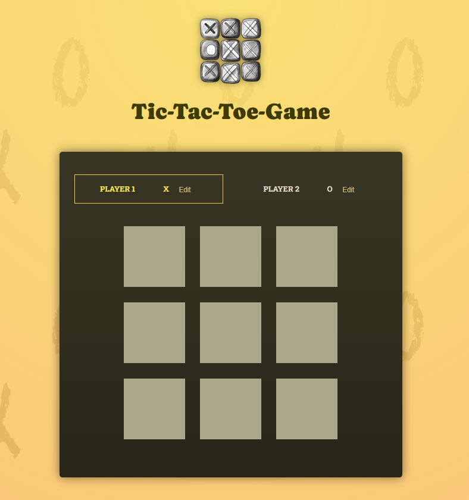
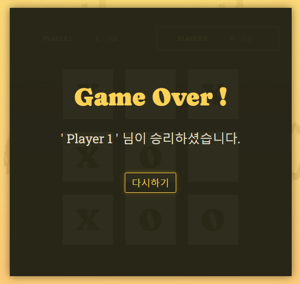
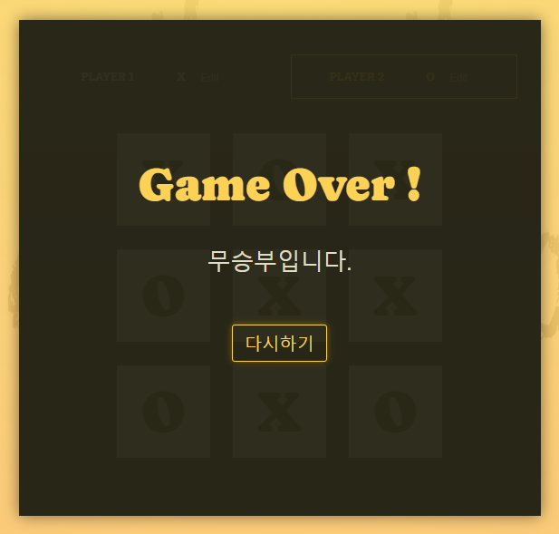

# tic-tac-toe-game ⭕❌
by.udemy React 완벽 가이드
#### [기간]
2023.12.24 ~ 2024.01.19
 
 

### 💌 tic-tac-toe (틱택토) 게임 규칙

1) 두 명의 플레이어가 번갈아 가며, 3x3 게임보드 위에 자신의 기호( O, X )를 찍음  
2) 한 플레이어는 'O' 를, 다른 플레이어는 'X' 를 사용  
3) 자신의 기호를 가로, 세로, 또는 대각선으로 연속 세개를 먼저 배열하는 사람이 승리 !

### 👀 preview

##### 승리 화면

##### 무승부 화면

##### 로그 화면

 

### [JS vs JSX]
#### JSX
- JavaScript 확장 문법
- JavaScript 안에서 HTML 사용 가능
- JavaScript 안에서 UI 관련 작업이 가능하고, 에러 및 경고 메시지 표시 가능
   
  
 => 필수는 아니지만 JSX 추천 !
